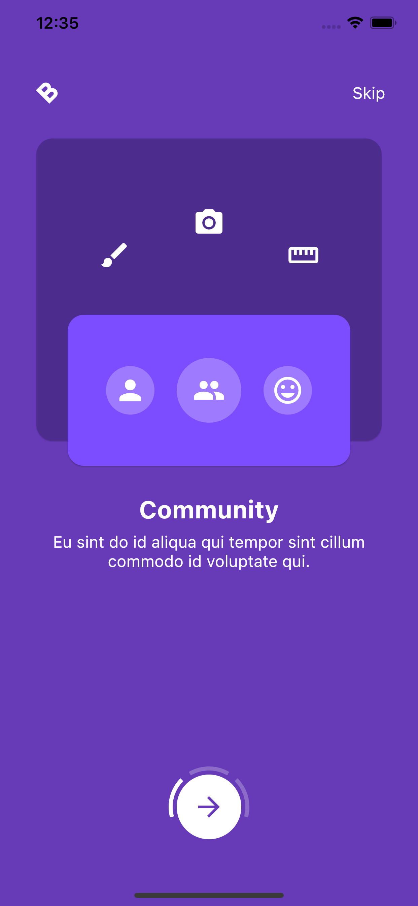
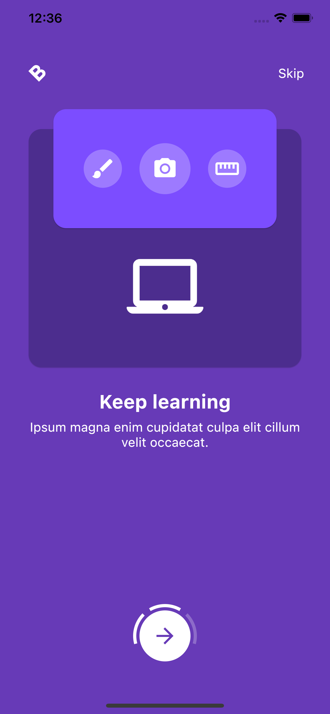
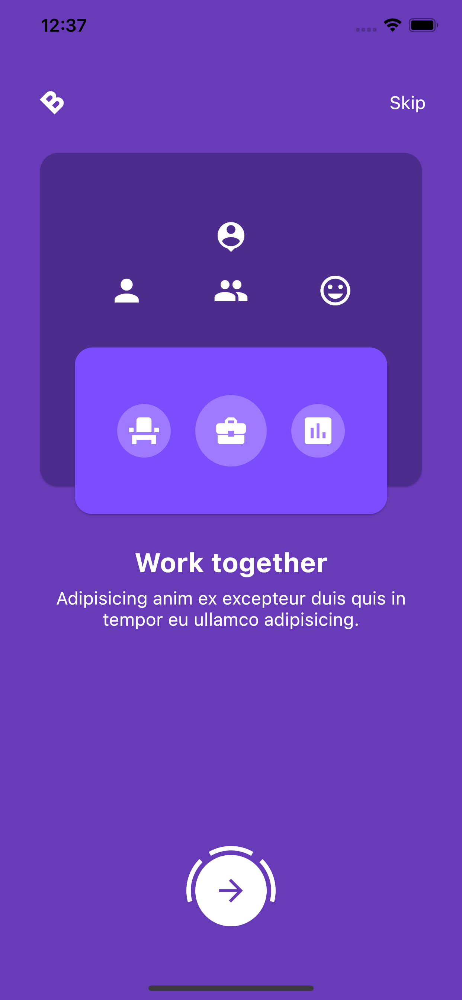
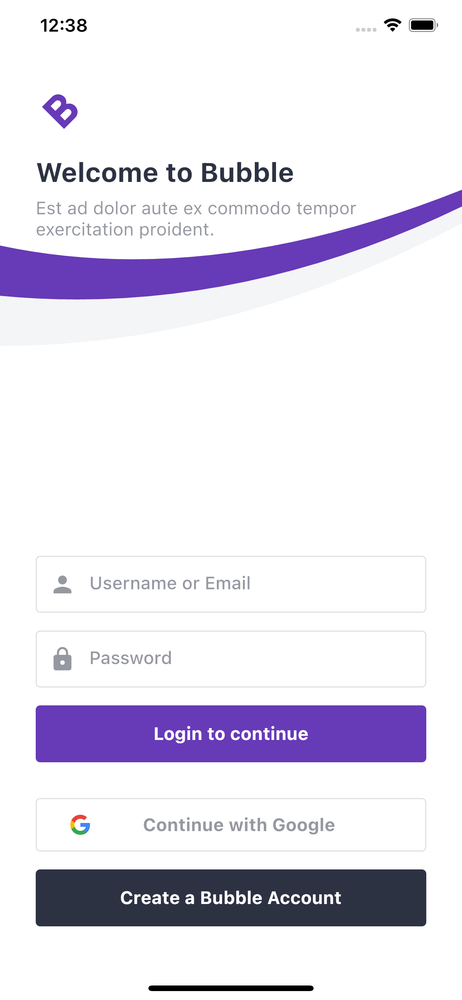

# 🔥🔥 Flutter Animated Onboarding And Login Page

Flutter project for creating animated onboarding and login screen.

Star⭐ the repo if you like what you like more stuff on flutter 😉.

## ✨ Requirements
* Any Operating System (ie. MacOS X, Linux, Windows)
* Any IDE with Flutter SDK installed (ie. IntelliJ, Android Studio, VSCode etc)
* A little knowledge of Dart and Flutter.

## Some Screenshots For You 💖

|
  
|

 

## 🤓 Author(s)
**Manish Dayma** 
